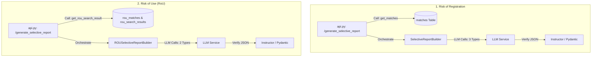

# Report Generation Modules: Detailed Comparison

This document provides a comparative analysis of two major pipelines in the system:
1. **Risk of Registration Report Generation Pipeline** (USPTO Marks)
2. **Risk of Use (RoU) Report Generation Pipeline** (Multi-Source Assessment)

---

## 1. Comparative Architecture Overview

Both pipelines implement the **Hybrid Builder Pattern** utilizing the base classes in `src/document_builder` (e.g. `DocumentTreeBuilder` and `TableGenerator`). However, they differ in how they load database records, map their internal schemas, and orchestrate their LLM inference queries.

---

## 2. Part I: Database Retrieval Architecture

| Dimension | Risk of Registration | Risk of Use (RoU) |
| :--- | :--- | :--- |
| **Primary Tables** | `matches`, `search_results` | `rou_matches`, `rou_search_results` |
| **Schema Complexity** | Flat, normalized tables designed for federal comparison data. | Hybrid model: ~60 promoted typed SQL columns + 4 JSONB overflow columns for nested metadata. |
| **Read Repository** | `MatchRepository` (queries `MatchModel`) | `RouMatchRepository` (queries `RouMatchModel`) through `rou_database.py`. |
| **Retrieval Query** | Calls `get_matches(result_id)` which runs a standard SELECT targeting the `matches` table. | Calls `get_rou_search_result(result_id)` to load search metadata and matches in one bundle. |
| **Selection Gating** | Fetches the full list of matches. The API parses the indices and filters them in memory via Python: `selected_matches = [m for i, m in enumerate(matches) if i in selected_indices]` | Fetches the full list of matches. The adapter builder filters them in memory using database rank indices: `[m for m in all_matches if m.get("match_index") in selected_indices]` |
| **Core Fields Retrieved** | `semantic_pct`, `phonetic_pct`, `lexical_pct`, `overall_risk_score`, status, classes. | `injunction_risk`, `damages_risk`, dormancy flags, WHOIS privacy states, circuit routing applicable tests, `reasoning_trace`. |

### Database Design & Layout Analysis

*   **Risk of Registration** queries map to standard USPTO registry records, which have an exact 1:1 mapping with the database table schema.
*   **Risk of Use** deals with 6 different source types (Federal USPTO, State Law, Web Common Law, Common Law, Business Names, and Domain Names). To avoid writing 6 different tables, the pipeline uses a shared table `rou_matches` containing null columns for irrelevant source types, backed by `JSONB` blobs for deep data structure recovery.

---

## 3. Part II: LLM Orchestration & Prompts

After loading the database contents, both modules run parallel and linear asynchronous calls to generate executive narratives and trademark sheets.

### A. Narrative Summary (Executive Content)

*   **Risk of Registration:**
    *   **Method:** `SelectiveReportBuilder._generate_executive_content()` calling `create_structured_response`.
    *   **Prompt Data passed:** Client mark name, client goods/services, calculated overall risk tier, count of high risk matches, and formatted string details of top 5 high-risk matches.
    *   **Pydantic response model:** `SelectiveExecutiveContentResult`.
*   **Risk of Use:**
    *   **Method:** `ROUTreeBuilder._generate_rou_executive_narrative()` calling the wrapper `LLMService.generate_risk_assessment()`.
    *   **Prompt Data passed:** Client search query mark, client goods/services description, highest risk score calculated, and first 10 matches list.
    *   **Pydantic response model:** Restores the same `SelectiveExecutiveContentResult`.

### B. Individual Citation Analysis

*   **Risk of Registration:**
    *   **Orchestration:** `SelectiveReportBuilder._build_detailed_analysis()` runs parallel mapping `_build_one()`.
    *   **Concurrency Constraint:** Enforces `asyncio.Semaphore` with a limit set by `SELECTIVE_REPORT_DETAIL_CONCURRENCY` env (default `4`). Runs `asyncio.gather` on all tasks.
    *   **Structured Schema:** Returns `SelectiveTrademarkAnalysisResult`.
*   **Risk of Use:**
    *   **Orchestration:** `ROUTreeBuilder._build_citation_analysis_section()` runs parallel mapping `_analyze_one()`.
    *   **Concurrency Constraint:** Uses the base utility `gather_with_limit` (with semaphore cap hardcoded to `MAX_CONCURRENT_LLM = 5`).
    *   **Structured Schema:** Returns the same `SelectiveTrademarkAnalysisResult`.

### C. Strategic Recommendations section

*   **Risk of Registration:**
    *   **Method:** `_build_recommendations` calls `_generate_recommendations()`, executing an LLM call mapped to the Pydantic schema `SelectiveRecommendationsResult` (containing strategies, research tasks, and warnings).
*   **Risk of Use:**
    *   **Method:** `_build_recommendations_section` compiles suggestions using a plaintext heuristic placeholder rather than doing an active LLM call.

---

## 4. Key Functional Differences Summary

1. **Query Pipeline:** Risk of Registration is integrated with the standard workspace cache (`cache.get(result_id)`). Risk of Use queries are read directly from PostgreSQL/SQLite `rou_matches` and `rou_search_results` database tables inside thread pools without workspace cache lookups.
2. **Concurrency Utility:** Risk of Registration uses native `asyncio.gather` wraps around checking semaphores. Risk of Use uses the robust centralized helper `gather_with_limit` from `src/document_builder/async_utils.py`.
3. **Structured Outputs:** Both pipelines rely on the Pydantic models from `src/llm_contracts.py` wrapped by Instructor to enforce strict data contracts, preventing report schema crashes in the dynamic web frontend.
